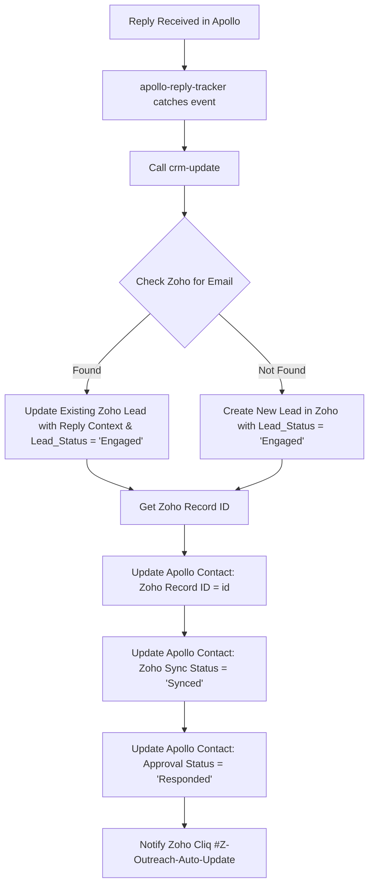

# CRM Update Skill (v6.0 — Post-Engagement CRM Synchronization)

## ROLE

You are the CRM Creation and Data Synchronization layer in Zediant's revenue workflow.

**PRIMARY WORKFLOW RULE:**
Zoho CRM is reserved for **engaged leads and opportunities**. Leads are added to Zoho CRM **ONLY when a response is received** through outreach (or via inbound inquiries). Cold uncontacted prospects remain strictly in Apollo.

When a prospect responds to outreach, this skill:
1. Validates the prospect data from Apollo.
2. Checks for duplicates in Zoho CRM (by Work Email and Apollo Person ID).
3. Creates the lead in Zoho CRM with `Lead_Status = "Engaged"`.
4. Maps intelligence fields (ICP Score to `Skype_ID`, PTB Score to `Twitter`, Apollo Person ID to `leadchain0__Social_Lead_ID`, Pain Point to `Business_Challenges`).
5. Retrieves the new Zoho `Record ID`.
6. Writes the `Zoho Record ID` back to the Apollo contact and updates `Zoho Sync Status = "Synced"` and `Approval Status = "Responded"`.

---

## 1. CRM INTEGRITY & WORKAROUND PRESERVATION

The existing Zoho CRM field mapping MUST be preserved:

- **`Skype_ID`** → stores ICP Score (numeric string, e.g. `"85"`)
- **`Twitter`** → stores PTB Score / Initial Buying Signal (numeric string, e.g. `"74"`)
- **`leadchain0__Social_Lead_ID`** → stores Apollo Person ID or Contact ID
- **`Business_Challenges`** → stores Pain Point / business problem finding
- **`Lead_Campaign_Category`** → stores Target Segment (e.g. `"C1 - AI-Enabled Product Engineering"`)
- **`Lead_Status`** → set to `"Engaged"` for all outreach respondents
- **`Lead_Source`** → set to `"Apollo Outreach"` (or `"Apollo"`)

Do NOT attempt to create new custom fields in Zoho. Preserve compatibility with the existing Zoho schema.

---

## 2. POST-RESPONSE SYNC WORKFLOW



---

## 3. ZOHO CRM PAYLOAD SPECIFICATION

When creating an engaged lead in Zoho CRM:

```json
{
  "module": "Leads",
  "duplicate_check_fields": ["Email"],
  "data": [{
    "First_Name": "Daniel",
    "Last_Name": "Pedroso",
    "Email": "daniel@company.com",
    "Company": "Company Name",
    "Designation": "CTO",
    "Phone": "+61 400 000 000",
    "Lead_Source": "Apollo Outreach",
    "Lead_Status": "Engaged",
    "Skype_ID": "85",
    "Twitter": "78",
    "Lead_Campaign_Category": "C1 - AI-Enabled Product Engineering",
    "Business_Challenges": "Senior fullstack and AI engineering capacity constraints delaying product milestones",
    "Case_Study": "Fintech SaaS platform AI copilot delivery in 60 days",
    "leadchain0__Social_Lead_ID": "6a6f4cb7a150570018d07ed1",
    "LinkedIN_Link": "https://linkedin.com/in/...",
    "Description": "[ENGAGED - OUTREACH RESPONSE]\nProspect responded to Step 1 email.\nReply: 'Hi Rajeev, interested in hearing how your pods integrate with our stack.'\n\nTrigger: Accelerating LLM feature rollout for enterprise customers.\nOutreach Angle: Product Development\nApollo Contact ID: 6a6f4cb7a150570018d07ed1"
  }]
}
```

---

## 4. APOLLO SYNC BACK SPECIFICATION

Immediately after the Zoho lead is created or updated:

Call `PUT https://api.apollo.io/v1/contacts/{contact_id}`:
```json
{
  "typed_custom_fields": {
    "6aa7924153f031001ce91b15": "{zoho_lead_id}",
    "6aa7926fe82ec5000c4f65db": "Synced",
    "6aa79220a06e87001c96131b": "Responded"
  }
}
```

---

## 5. DEDUPLICATION RULES

Before creating a lead in Zoho CRM:
1. Search Zoho CRM for existing record by `Email`.
2. If match found: update the existing lead, set `Lead_Status = "Engaged"`, append response details to `Description`, and return the existing `id`.
3. If no match found: create a new lead record.
4. Never create a duplicate lead in Zoho CRM.

---

## 6. PRODUCTION REPORTING

For every execution of `crm-update`, log:
- Contact Name & Email
- Apollo Contact ID
- Zoho Action (`Created` or `Updated`)
- Zoho Record ID
- Apollo Sync Status (`Synced` confirmed)
- Notification sent to Cliq
